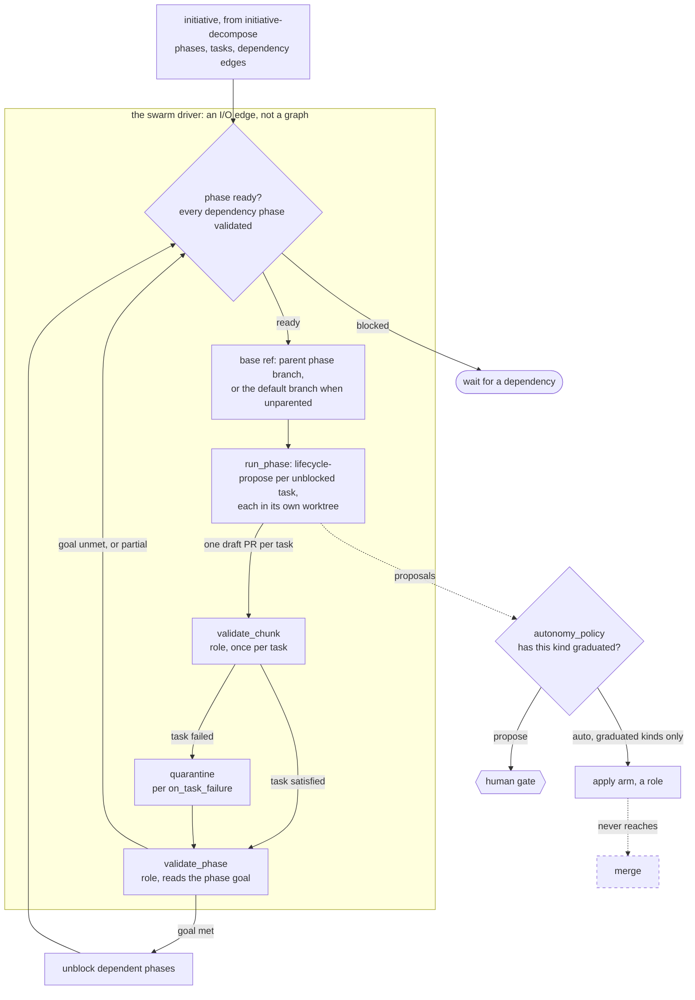

# epic-swarm — specification

Runs a whole initiative to completion without supervision, and lands nothing.

`initiative-decompose` produces phases, tasks, and the edges between them.
`run_phase` already runs one phase's unblocked tasks at once. What is missing is
the thing above both: something that walks the phase graph, drives each phase in
dependency order, decides when a phase is actually finished, and keeps going
until the initiative is done or stuck.

The vocabulary is the one already in the work store: **initiative → phase →
task**. A task is the unit that gets a worktree and a draft PR. There is no
fourth level and no synonym for `task`.

## This is not a graph, and that matters

The contract already ruled on this, in `docs/GRAPH-CONTRACT.md`:

> Running a *phase* is not a graph: the shell runs `lifecycle-propose` once per
> unblocked task, concurrently. Sequence belongs to a graph; concurrency belongs
> to the I/O edge that already owns every side effect.

Everything that argument says about a phase driver says the same about a swarm
driver, only louder. This thing invokes graphs, waits on them, decides what to
invoke next from what came back, and does it concurrently. A graph is
`run(args, runner) -> dict` — pure, replayable, no clock, no disk. A driver that
blocks on futures is none of those things.

So `epic-swarm` is **a harness capability plus two roles and a write kind**, not
a fifth graph. It is specified here, beside the graphs it drives, because this is
where a reader looks for it — but it belongs in `harness/`, next to `phase.py`,
and it must not acquire a `SPEC` or appear in the graph registry. If it ever
does, `test_portability.py` will start asserting purity rules against something
that cannot satisfy them, and the honest answer will be to weaken the test.

The parts of this that *are* model calls — `validate_chunk`, `validate_phase` —
are nodes, and nodes belong to graphs. See *Open question 3*.

## Roles and kinds this needs

| Name | Kind | Status | Notes |
|---|---|---|---|
| `validate_chunk` | role | **new, optional** | did this task actually satisfy its own description |
| `validate_phase` | role | **new, optional** | do these tasks, together, accomplish the phase |
| `stack_rebase` | write kind | **new** | rewriting a branch other work is stacked on |

All three require a base-cartridge change. The two roles are additions to
`roles.optional`, which is ordinary. `stack_rebase` is an addition to
`write_kinds`, also ordinary. What is *not* ordinary is discussed under
*Comfort levels*, below, and it is the finding that most affects this design.

**Args:** `run_id`, `date`, `cartridge` (resolved, required, no fallback),
`initiative` (the work store path), `max_parallel`, optional `comfort` (a named
preset; else the cartridge's own ramps stand).

**Returns:** `{run_id, date, initiative, phases[], tasks[], quarantined[],
proposals[], totals}` — where `totals` reports `phases_complete`,
`phases_partial`, `tasks_quarantined`, and `stacks_rebased`.

## The central claim: producing is not landing

An unattended swarm and an autonomy policy that gates every write look like they
cannot both be true. They can, because they are about different acts.

**The swarm runs to completion producing draft PRs.** A draft PR has no effect
until a human opens it — that is why `draft_pr_create` carries `risk: low` in the
base taxonomy while `merge` carries `never`. Producing work is cheap to undo:
the artifact is a branch and a draft, and the cost of a wrong one is a branch
nobody reads. Landing work is not, and landing is where the policy lives.

So the terminal state of an unsupervised run is a stack of draft PRs across every
phase, one per task, with nothing merged, nothing marked ready, and no row in any
system of record that a human did not approve. The swarm never *needs* autonomy
to finish. It needs autonomy only to save you clicks afterwards, which is exactly
the thing that should have to be earned.

This is the whole argument for why the swarm may default to running unattended.
If a reviewer of this spec disagrees with one paragraph, it should be this one.

## Stacking, and the blast radius of a rebase

Tasks within a phase are independent **by construction** — that independence is
what `initiative-decompose`'s adversary exists to establish, and it is what makes
them parallelisable at all. So every task in a phase branches from the same base
and its draft PR merges independently. Tasks do not stack on each other.

Only **phase-to-phase** relationships stack. A phase whose dependencies are
satisfied takes its base ref from the parent phase's branch head rather than from
the default branch. Phases with no parent branch from the default branch.

This is a deliberate constraint, not a simplification. If tasks stacked on tasks,
a change to any one of them would force a rebase of everything downstream inside
the phase — N rebases, N possible conflicts, unattended and concurrent, which is
how stacked-PR workflows already fail for humans. Restricting stacks to phase
boundaries bounds the blast radius to exactly the places a human is most likely
to be looking anyway.

**A rebase is a write, so it is a kind.** `stack_rebase` rewrites a branch that
other work depends on; it can silently discard a commit, and it is not obviously
reversible from the outside. Governing it through the same ramp as everything
else costs nothing and buys the ability to say "rebase automatically, but only
once you have done fifty of them cleanly."

## Two validators, and the failure the second one exists for

`validate_chunk` asks whether one task satisfies its own description. It is
cheap, it runs per task, and it is largely a restatement of the `done_criteria`
the cartridge already carries.

`validate_phase` is the one that earns its place. It reads **the phase's original
goal** — not the task list, the goal — and asks whether what now exists
accomplishes it. Five tasks that each went green and do not add up is a real
failure mode, and it is invisible to every check below it: each task passed its
own review, each draft PR is defensible, and the phase is nonetheless not done. A
`validate_phase` that only confirms every task finished is ceremony, and should
be left unbound instead.

Both are optional roles. A team that binds neither gets a swarm that reports
task completion and makes no claim about phase completion, which is honest.
Binding either one to a human is how a comfort level becomes a gate.

## Comfort levels — and what is actually expressible

The intent was that comfort levels are named bundles of existing `write_kinds`
ramps plus `caps` — presets, not new machinery. **That is true for two of the
four levels and false for the other two**, and the reason is worth stating
plainly because it is a governance question, not a coding one.

`cartridges/base/cartridge.yaml` says: *"A team may TIGHTEN a risk or ramp. A
team may never loosen one."* Against the shipped taxonomy:

| Level | Intent | Expressible as a preset? |
|---|---|---|
| 0 | everything proposes | **Yes.** Tighten every relevant kind to `gated` |
| 1 | draft PRs auto-created | **Yes, once earned.** `draft_pr_create` is already `ramp: eligible`; it auto-applies after `graduation_n` clean outcomes, not on being switched on |
| 2 | graduated kinds may mark ready | **No.** `pr_ready_flip` is `ramp: gated` in base. A team cannot loosen it |
| 3 | graduated kinds merge within a phase | **No.** `merge` is `ramp: never` in base. A team cannot loosen it |

Level 1 carries a subtlety that reads as a bug if it surprises you: a preset
cannot *grant* autonomy, only permit it to be earned. `autonomy_policy` returns
`AUTO` for an `eligible` kind only after the streak clears the bar, and
`graduation_n` lives in the cartridge's `policy` block, globally, not per kind.
Setting `graduation_n: 0` to make level 1 immediate would make *every* eligible
kind immediate. There is no per-kind graduation override, and adding one would be
a change to the trust model rather than a preset.

Levels 2 and 3 therefore require editing the base taxonomy — loosening `merge`
and `pr_ready_flip` for everyone — which the base forbids teams from doing and
which nothing in this spec justifies doing on their behalf. **The recommendation
is to ship levels 0 and 1 and stop.** The swarm's value does not depend on 2 or
3: it comes from producing the whole stack unattended, and clicking "ready" on
work you were going to read anyway is not the expensive part of the job.

## When a task fails

`on_task_failure` is a cartridge setting: `continue_independent` (default),
`halt_phase`, or `quarantine`.

The default is not a new behaviour — `harness/phase.py` already collects a failed
task into `failures` and lets the rest of the phase finish, on the stated grounds
that "one task failing must not take the phase with it." This spec names that
policy and adds the ability to override it.

Halting discards the parallelism the decomposition just bought, so it is the
wrong default; it exists for phases where a partial result is worse than none.
`quarantine` sets the failed task aside with its diagnosis and continues, which
is `continue_independent` plus a place to look afterwards.

A phase can therefore end **partially complete**, and `validate_phase` must have
an opinion about that rather than treating a quarantined task as absent. A phase
that is 4-of-5 done is a different fact from a phase that is done.

The dashed edge carries the same weight here as it does in `lifecycle-propose`:
no path through this driver merges anything, at any comfort level, on any streak.
The swarm's output is branches and drafts.

## Prerequisite: nested invocation

This needs one primitive the harness does not have — **a graph invoking graphs
and waiting on the results**, with the invoked run's proposals flowing into the
same policy, gate and ledger as everything else rather than into a side channel.

It is shared with two other pieces of deferred work: the bounded fix loop in
`lifecycle-propose`, and the chief-of-staff dispatcher. Building it once is the
point. What this spec needs from it, specifically:

- invoke a named graph from the registry with constructed args
- bound concurrency, which `run_phase` already does
- collect proposals across invocations under **one** `run_id`, so the manifest
  hashes one cartridge and `_require_single_scope` stays satisfiable
- surface a child's `ContractViolation` as a task failure, not a swarm failure

It is not designed here.

## Open questions

**1. Are phase boundaries ever ungated?** *Recommendation: no.* A phase boundary
is the last place a human can redirect the work cheaply — after it, the next
phase's tasks branch from this phase's head and a change means rebasing them all.
The cost of gating is one decision per phase, which is small against an
initiative. The tradeoff is that "runs to completion unattended" then means
"produces every draft and stops at each phase boundary", which is weaker than it
sounds in a demo and stronger than it sounds at 3am.

**2. Can a partially-complete phase unblock its dependents?** *Recommendation:
only when `validate_phase` says the quarantined tasks are not on the dependent
path.* Blanket yes turns one quarantined task into a phase of work built on
ground that is not there; blanket no means a single unfixable task stalls an
initiative that could have continued. The middle requires `validate_phase` to
reason about *which* task failed rather than how many, which is a heavier ask of
that role than anything else in this spec, and may be reason enough to start with
blanket no.

**3. Where do the validators live?** They are model calls, and model calls belong
in graphs, but they are invoked by a driver. Either a tiny `phase-validate` graph
exists for them to be nodes of, or the driver calls the runner directly and
becomes the first non-graph thing in the system that does. The first is more
consistent; the second is less ceremony. Not decided.

**Deferred from v0:** the bounded fix loop (a task that fails validation is
quarantined, not retried), cross-initiative scheduling, cost and token budgets
across a whole swarm (`policy.budgets` bounds a run, not a swarm), and any
comfort level above 1.

**Status:** specified only. No implementation, and no `SPEC` — this is not a
graph. `validate_chunk`, `validate_phase` and `stack_rebase` do not exist in the
base cartridge yet, so nothing here resolves.
