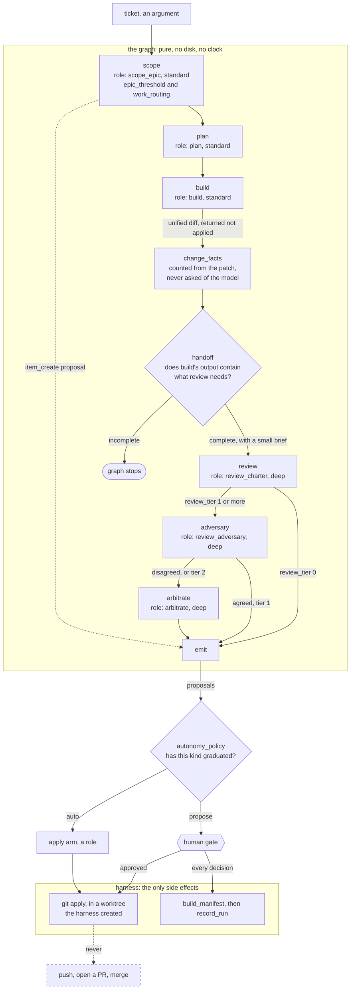

# lifecycle-propose — specification

The development loop. Takes one ticket, produces reviewed work and proposals.
Nothing is pushed, opened, or merged.

**Nodes** (v0 cut — keep every node that reads the cartridge, drop every node
that only reads other nodes):

| Node | Role | Tier | Writes |
|---|---|---|---|
| `scope` | `scope_epic` | standard | none (read-only, **optional role**) |
| `plan` | `plan` | standard | none (read-only) |
| `build` | `build` | standard | its own worktree only |
| `review` | `review_charter` | deep | none |
| `emit` | — | — | proposals as data |

`scope` runs first and only if the team bound `scope_epic` — unbound means absent,
which is what an optional role means. It applies the cartridge's `epic_threshold`
to decide epic / parent-with-subtasks / single ticket, routes the result through
`work_routing`, and emits a `item_create` proposal carrying both decisions as
evidence. Scoping is a separate act from filing, and it runs before planning
because it decides whether this is even one ticket.

The table says which node writes what. What it cannot show is *where the write
actually happens* — the build node produces a patch and applies nothing, and the
shell applies it, on the far side of the gate:

Two things the node table cannot show. The dashed edge is the point of the
graph: a draft PR is *emitted as a proposal* and never executed, and nothing is
pushed or merged by any path. And `handoff` has an edge that leaves the graph
entirely — an incomplete handoff stops the run rather than letting review form a
confident opinion about a half-finished change.

How many reviewers a change gets is `review_tier`'s decision, not the author's:
tier 0 is reviewed once, tier 1 gets an adversary, and tier 2 arbitrates whether
or not the two agreed. No path skips review.

**Args:** `run_id`, `date`, `cartridge` (resolved, required, no fallback),
`ticket`, optional `worktree_root` (else `cartridge.landing_areas.worktree_root`).

**Returns:** `{run_id, date, ticket, plan, build, review, change_facts, proposals[]}`

**Deferred from v0:** intake queue (the ticket arrives as an arg), the
adversarial reviewer pair, arbitration, the bounded fix loop, verification,
retro. Staging a draft PR is *emitted* as a `draft_pr_create` proposal and never
executed.

*Epic-threshold scoping was on that list and is now implemented* — `epic_threshold`
and `work_routing` were declared in the base cartridge and read by no code,
which is exactly the drift the cartridge seam exists to prevent.

**Status:** implemented in [`lifecycle_propose.py`](lifecycle_propose.py). The
build node returns a unified diff and applies nothing; `shell.py` applies it in
a worktree it owns, and only after the gate approved the work.
