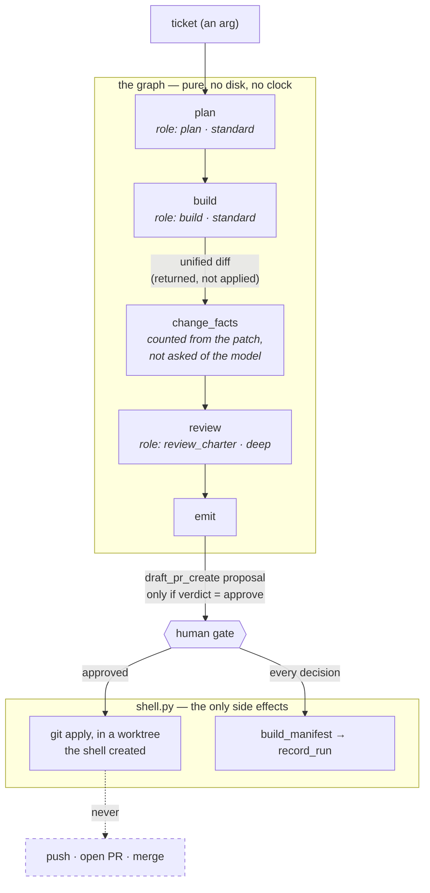

# lifecycle-propose — specification

The development loop. Takes one ticket, produces reviewed work and proposals.
Nothing is pushed, opened, or merged.

**Nodes** (v0 cut — keep every node that reads the cartridge, drop every node
that only reads other nodes):

| Node | Role | Tier | Writes |
|---|---|---|---|
| `plan` | `plan` | standard | none (read-only) |
| `build` | `build` | standard | its own worktree only |
| `review` | `review_charter` | deep | none |
| `emit` | — | — | proposals as data |

The table says which node writes what. What it cannot show is *where the write
actually happens* — the build node produces a patch and applies nothing, and the
shell applies it, on the far side of the gate:

The dashed edge is the point of the graph: a draft PR is *emitted as a proposal*
and never executed, and nothing is pushed or merged by any path through this
diagram.

**Args:** `run_id`, `date`, `cartridge` (resolved, required, no fallback),
`ticket`, optional `worktree_root` (else `cartridge.landing_areas.worktree_root`).

**Returns:** `{run_id, date, ticket, plan, build, review, change_facts, proposals[]}`

**Deferred from v0:** intake queue (the ticket arrives as an arg), epic-threshold
scoping, the adversarial reviewer pair, arbitration, the bounded fix loop,
verification, retro. Staging a draft PR is *emitted* as a `draft_pr_create`
proposal and never executed.

**Status:** implemented in [`lifecycle_propose.py`](lifecycle_propose.py). The
build node returns a unified diff and applies nothing; `shell.py` applies it in
a worktree it owns, and only after the gate approved the work.
