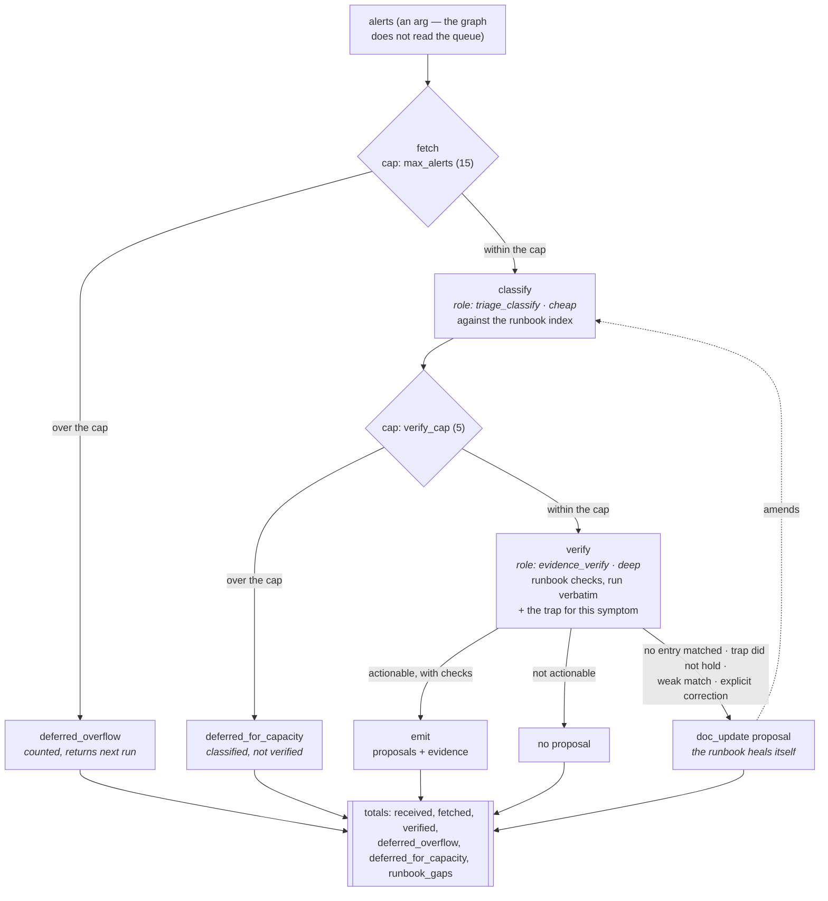

# triage-propose — specification

Morning triage of an alert queue. Strictly read-only everywhere.

| Node | Role | Tier | Notes |
|---|---|---|---|
| `fetch` | — | standard | open alerts from the queue; capped, overflow counted not dropped |
| `classify` | `triage_classify` | cheap | symptom key per alert, against a runbook index |
| `verify` | `evidence_verify` | deep | runbook-guided; deterministic checks run verbatim |
| `emit` | — | — | proposals with evidence attached |

**Args:** `run_id`, `date`, `cartridge` (required, no fallback), optional
`max_alerts` (default 15).

The sequence is the least interesting thing here. What matters is the two caps
and the fact that neither one drops anything on the floor:

Every path ends at `totals`. That is deliberate: a graph that drops nine of ten
alerts and reports success on the tenth is worse than one that fails, so both
caps report what they set aside rather than truncating silently. Note also that
only a *verified* alert can produce a proposal — an unverified one has no
evidence, and a claim without evidence is not a proposal.

**Runbook index** is a cartridge-provided path, not a skill-layout assumption.
Each entry carries `match`, the `kinds` it may emit, a `risk`, and — most
usefully — the `trap`: the known wrong belief for that symptom. A runbook that
only states the right answer lets the next person re-derive the wrong one.

## The runbook heals itself

The index is not read-only input. A run is the only moment anyone has the
evidence to improve an entry, and by the time the incident is over nobody goes
back, so `verify` reports two things the runbook cannot learn any other way —
whether the entry's `trap` actually held, and what the entry gets wrong. Four
cases emit a `doc_update` proposal:

| Case | Proposal |
|---|---|
| No entry matched the symptom | add an entry, with its trap |
| The node named an explicit correction | amend that entry, verbatim |
| The stated `trap` did not hold | amend the trap — as written it points at the wrong belief |
| The match was weak (`confidence: low`) | sharpen the match criteria |

This does **not** put a write into a read-only graph: a `doc_update` is a
proposal like any other, gated like any other. It is `deferred` in the base
taxonomy, so it cannot auto-apply until the eligible kinds have earned their
ramp — the runbook does not get to start rewriting itself on day one.

That ramp is currently measured per *kind*, which averages every entry in the
index together. It should be measured per *entry*, with incidents demoting the
entry they implicate — see [`docs/RUNBOOK-TRUST.md`](../docs/RUNBOOK-TRUST.md).

**Fetch cap** must exceed the verify cap comfortably; a busy queue otherwise
blows the structured-output limit and the run dies mid-flight. Overflow defers
to the next run and is reported in the totals.

**Status:** implemented in [`triage_propose.py`](triage_propose.py). Alerts
arrive as an argument — the graph does not read the queue itself, because a node
that fetches cannot be replayed. Both caps report their overflow in `totals`.
